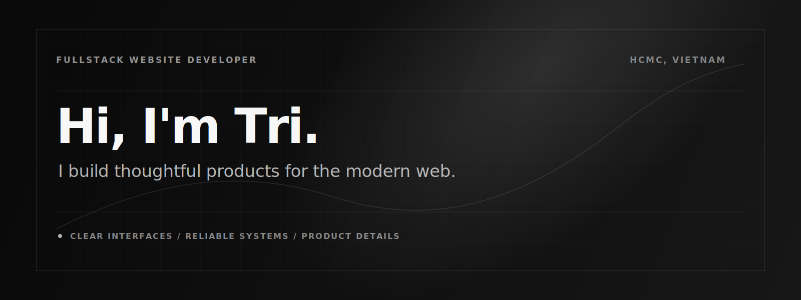

<!--
  Design choices:
  - Keeps the portfolio's dark, minimal direction through a monochrome SVG banner, thin dividers,
    quiet spacing, and restrained typography.
  - Softens the tone with a short "Hi, I'm Tri" introduction and less corporate section language.
  - Uses icon rows instead of badge blocks or widget panels so the README stays clean and readable.
-->

  

# Hi, I'm Tri.

I build modern fullstack web products with clear interfaces, reliable systems, and a strong sense for product details.

  <a href="https://minhtrii31.dev">Portfolio</a>
  &nbsp;/&nbsp;
  <a href="mailto:minhtri3101200@gmail.com">Email</a>
  &nbsp;/&nbsp;
  <a href="https://github.com/minhtrii31">GitHub</a>

 

## About

I'm a fullstack website developer based in Ho Chi Minh City. I like building useful web apps that feel simple on the surface and stay maintainable underneath.

My work usually sits between product, interface, and system design: shaping flows, building components, designing APIs, and keeping the implementation clean enough to grow.

 

## Selected Projects

**AI CV Platform**  
An AI-assisted CV workflow for resume review, job-fit analysis, and application preparation.

**QuanBao**  
A business website and content system focused on clear structure, credibility, and practical publishing.

**Movie Streaming Platform**  
A MERN-based movie streaming platform focused on content discovery, user watch history, ratings, and admin-managed media workflows.

 

## Stack

  <strong>Frontend</strong>
   
  
  &nbsp;
  
  &nbsp;
  
  &nbsp;
  
  &nbsp;
  
   
  Next.js / React / TypeScript / TailwindCSS / shadcn/ui

  <strong>Backend</strong>
   
  
  &nbsp;
  
  &nbsp;
  
   
  Node.js / Express / NestJS

  <strong>Database</strong>
   
  
  &nbsp;
  
  &nbsp;
  
   
  MongoDB / PostgreSQL / Redis

  <strong>Tools</strong>
   
  
  &nbsp;
  
  &nbsp;
  
   
  Docker / GitHub Actions / Vercel

 

## Links

- Portfolio: [minhtrii31.dev](https://minhtrii31.dev)
- Email: [minhtri3101200@gmail.com](mailto:minhtri3101200@gmail.com)
- GitHub: [@minhtrii31](https://github.com/minhtrii31)

 

---

  Thoughtful interfaces. Reliable systems. Useful products.

<!--
Assets structure:

.
|-- README.md
`-- assets
    `-- profile-banner.svg
-->
